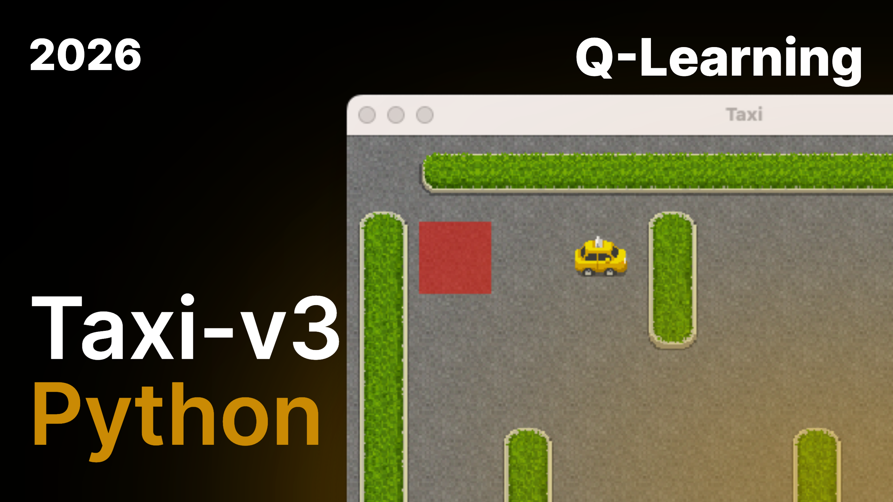

# 🚕 Q-Learning Taxi-v3



🚕 This repository contains the implementation of a Reinforcement Learning agent capable of solving the "Taxi" problem from the OpenAI Gym environment.

## 📌 Project Overview

The goal of this project is to train a reinforcement learning agent to navigate a 5x5 grid world. The agent must:

1. Pick up a passenger at a designated location.
2. Drop them off at the correct destination.
3. Minimize the number of steps and avoid illegal actions.

The agent learns the optimal strategy through the **Q-Learning** algorithm, exploring the environment and receiving rewards based on its performance.

## 🧠 Key Concepts

This implementation focuses on the fundamental parameters of Reinforcement Learning:

| Parameter                  | Value          | Description                                          |
| -------------------------- | -------------- | ---------------------------------------------------- |
| **Alpha** (\(\alpha\))     | `0.9`          | Learning rate                                        |
| **Gamma** (\(\gamma\))     | `0.95`         | Discount factor (importance of future rewards)       |
| **Epsilon** (\(\epsilon\)) | `1.0` → `0.01` | Exploration rate with decay (`0.9995`)               |
| **Episodes**               | `10,000`       | Number of training episodes                          |
| **Max Steps**              | `100`          | Maximum number of steps per episode                  |

- **Q-Table**: A matrix of `500 states × 6 actions` updated via the Bellman equation.
- **Epsilon-Greedy Strategy**: Exploration/exploitation with progressive epsilon decay.

## 🛠️ Installation & Setup

This project was developed using a Python virtual environment and **Jupyter Notebook**.

### 1. Clone the repository and create a virtual environment

```bash
git clone git@github.com:LenySauzet/q-learning-taxi-v3.git
cd q-learning-taxi-v3

# Create the virtual environment
python -m venv venv

# Activate (macOS/Linux)
source venv/bin/activate

# Activate (Windows)
.\venv\Scripts\activate
```

### 2. Install dependencies

```bash
pip install -r requirements.txt
```

**Main dependencies:**

- `jupyter` - Interactive notebook environment
- `gymnasium[toy-text]` - Simulation environment (successor to OpenAI Gym)
- `numpy>=1.24.0` - Numerical computing

## 🚀 How to Run

1. Make sure your virtual environment is activated.
2. Launch Jupyter Notebook:
   ```bash
   jupyter notebook
   ```
3. Open `main.ipynb` and run the cells sequentially to train and visualize the agent's performance.

## 📂 Project Structure

```
q-learning-taxi-v3/
├── main.ipynb        # Main notebook with Q-Learning code
├── requirements.txt  # Python project dependencies
├── thumbnail.png     # Project presentation image
├── README.md         # Project documentation
└── venv/             # Python virtual environment (not versioned)
```

## 📊 Results

The trained agent is capable of finding the shortest path to the passenger and destination without any wrong moves, demonstrating the efficiency of Q-Learning in discrete state spaces.